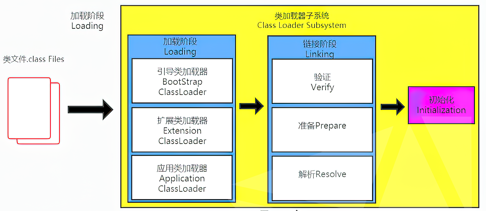

# 类加载子系统

## 1 类加载器与类的加载过程

### (1) 类加载器子系统的作用
* 类加载器子系统负责从文件系统或者网络中加载Class文件，class文件在文件开头有特定的文件标识
* Class Loader只负责文件的加载，至于是否可以运行则有Execution Engine来负责决定
* 加载的类信息存放于方法区内
### (2) 类加载器的角色
* .class文件存在于本地磁盘上, 可以理解为一种设计模版, 最终这个模版需要加载到JVM当中来
* 被加载到JVM中的class file文件被称为DNA元数据模版, 存放在方法区
* Class Loader就是扮演.class文件=>DNA元数据模版的过程的快递员角色 
### (3) 加载class文件的方式
* 本地
* 网络, webapplet
* zip压缩包读取, jar、war格式基础
* 运行时计算生成, 动态代理技术
* 专有数据库提取
* 从加密文件中提取
### (4) 类加载的过程

#### 加载:
* 通过一个类的全限定名获取定义此类的二进制字节流
* 将这个字节流所代表的静态存储结构转化成方法区的运行时数据结构
* 在内存中生成一个代表这个类的java.lang.Class对象, 作为方法区这个类的各种数据访问入口
#### 链接:

#### 初始化:
* 初始化阶段执行类构造器方法\<clinit>()的过程
* 此方法不需要定义, 是javac编译器自动收集类中的所有类变量赋值动作和静态代码块中的语句合并而来
* 构造器方法中指令按照语句在源文件中的出现顺序执行
* 虚拟机必须保证一个类的\<clinit>()方法在多线程下被同步加锁
***
## 2 类加载器分类
分成两类引导类加载器(Bootstrap ClassLoader)和自定义类加载器(继承自CLassLoader类)
### (1) 虚拟机自带的类加载器
#### Bootstrap ClassLoader
* 唯一使用C/C++语言实现
* 用来加载Java的核心库
* 并不继承自ClassLoader, 没有父加载器
* 加载Extension、App类加载器, 并指定为他们的父类加载器
* 出于安全考虑, 只加载敖丙为java、javax、sun开头的类

#### Extension ClassLoader
* 从java.ext.dirs系统属性所指定的目录中加载类库或从JAVA_HOME/jre/lib/ext 目录下加载类库

#### AppClassLoader
* **该类加载器是程序中默认的加载器**
* 负责加载环境变量classpath或系统属性 java.class.path指定路径下的类库
* 通过ClassLoader.getSystemClassLoader()方法可以获取
### (2) 用户自定义类加载器
#### 原因:
* 隔离加载类
* 修改类加载方式
* 拓展加载源
* 防止源码泄漏

### 实例:
```java
public class Test {
    public static void main(String[] args){
        //获取系统类加载器
        ClassLoader classLoader1 =  ClassLoader.getSystemClassLoader();
        System.out.println(classLoader1.getClass().getName());
        //获取当前线程上下文的类加载器
        ClassLoader classLoader3 = Thread.currentThread().getContextClassLoader();
        System.out.println(classLoader3.getClass().getName());
    }
}
/*out:
* sun.misc.Launcher$AppClassLoader
* sun.misc.Launcher$AppClassLoader
* */
```
***
## 3 双亲委派机制
JVM对class文件采取**按需加载**的方式, 而且加载某个类的class文件时, JVM采取的是**双亲委派机制**, 即将请求交由父类处理
### (1) 工作原理
* 当一个类收到类加载请求时, 不会先自己加载, 而是将这个请求委托交给自己的父类加载器去执行
* 如果父类加载器依然有父类加载器,则会依次递归向上请求
* 如果父类加载器可以完成类加载任务, 就成功返回, 否则子类加载器再尝试自己加载


### (2) 优势
* 避免类的重复加载
* 防止核心API被随意篡改(沙箱安全机制). 自定义一个String类, 但是在加载String类时会首先使用Bootstrap Classloader去加载jdk自带的java.lang.String
***

## 4 其他
### (1) 判断两个class对象是否为同一个类
* 包括包名的完整类名是否一致
* 加载这个类的ClassLoader是否一致
### (2) 对类加载器的引用
如果一个类是由用户类加载器加载的, 那么JVM会将类加载器的一个引用作为类型信息的一部分保存在方法区中.
### (3) java对类主动使用的7种情况(会导致类的初始化)
* 创建类实例
* 访问某个类或接口的静态变量, 或者修改这个静态变量
* 调用类的静态方法
* 反射
* 初始化一个类的子类
* Java虚拟机启动时被标明为启动类的类
* JDK7开始提供动态语言的支持, java.lang.invoke.MethodHandle实例的解析结果, REF_getStatic\REF_putStatic\REF_invokeStatic句柄对应的类没有初始化, 则初始化

