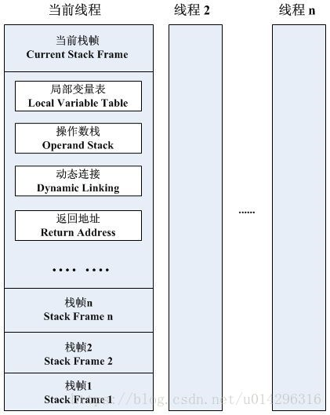
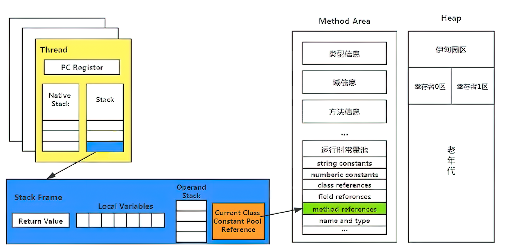

#虚拟机栈
***
## 1 基本内容
### (1) 虚拟机栈是什么
Java Virtual Machine Satck, 早期也叫Java栈, 每个线程在创建时都会创建一个虚拟机栈, 其内部保存着一个个的栈帧(Stack Frame), 对应着一次次的Java方法调用
### (2) 生命周期
和线程保持一致
### (3) 作用
主管Java程序的运行, 保存方法的局部变量\部分结果, 并参与方法的调用和返回
### (4) 特点
* 栈是一种快速有效的分配存储方式, 访问速度仅次于程序计数器
* JVM直接对栈的操作有: 方法执行时的入栈和压栈, 执行结束后的出栈工作
* 对栈来说不存在垃圾回收问题
### (5) 栈中可能出现的异常
java虚拟机规范允许java的虚拟机栈的大小时动态的
* **StackOverflowError**: 如果采用固定大小的虚拟机栈, 那么每一个线程的java虚拟机栈容量可以在线程创建时就独立选定.如果线程请求分配的栈荣容量超过jave虚拟机允许的最大容量时就会抛出.
```java
public class Test {
    public static void main(String[] args) {
        test();
    }

    public static void test(){
        test();
    }
}
/*
*抛出StackOverflowError
*程序不断的递归调用, 导致不停的压栈
*/
```
* **OutOfMemoryError**: 如果Java虚拟机的栈可以动态拓展, 并且在尝试拓展时无法申请到足够的内存, 或者在创建新线程时没有足够的内存, 就会抛出.
### (6) 设置栈内存大小
使用参数-Xss选项来设置最大栈空间, 栈的大小直接决定了函数调用的最大可达深度
```java
public class StackDeepTest {
    private static int count = 0;

    public static void recursion(){
        count++;
        recursion();
    }

    public static void main(String[] args) {
        try {
            recursion();
        }
        catch (Exception e){
            e.printStackTrace();
        }
        finally {
            System.out.println("deep of calling:"+count);
        }
    }
}
```
***
## 2 栈的存储单位
### (1) 栈帧

* 栈中的数据都是以栈帧的格式存在
* 每个线程上正在执行的方法都各自对应一个栈帧
### (2) 当前帧
* 在一条活动的线程中, 一个时间点上, 只会有一个活动的栈帧. 即只有当前正在执行的方法的栈帧是有效的, 这个栈帧被称为**当前栈帧(Current Frame)**, 定义这个方法的类就是**当前类(Current Class)**
* 执行引擎运行的所有字节码指令只针对当前栈帧进行操作
* 如果该方法调用了其他方法, 对应的新栈帧就会被创建出来, 压栈.
* 不同线程中的栈帧是不存在相互引用的
### (3) 栈帧的弹出
* 正常函数返回
* 抛出异常
### (4) 栈帧的内部结构
如上图所示, 主要包含四部分: 
* 局部变量表
* 动态链接
* 操作数栈
* 方法返回地址
***
## 3 局部变量表
* 定义为一个数字数组, 主要用于存储方法的参数和定义在方法体内的局部变量, 包括基本数据类型\对象引用\以及returnAddress类型
* 不存在数据安全问题: 局部变量表是建立在线程的栈上, 是线程私有数据
* **局部变量所需要的容量大小是在编译期就决定的**, 在方法运行期间是不会改变局部变量表的大小的
* 方法嵌套调用的次数由栈的大小决定
* 局部变量表中的变量只在当前方法的调用中有效,当方法调用结束后, 随着栈帧的销毁, 局部变量表也会随之销毁.
* 在栈帧中, 与性能调优最为密切的就是前面提到的局部变量表, 方法执行时, 虚拟机使用的局部变量表完成方法的传递.
* **只要被局部变量表中直接或者间接引用的对象就会被垃圾回收**
### (1) 变量槽Slot
* 参数值总是放在局部变量表数组的index0开始, 到长度-1的索引结束
* 局部变量表最基本的存储单元就是Slot
* 局部变量表中存放编译期可知的各种基本数据类型, 引用数据类型, returnAddress类型的变量
* 32位以内的类型只占一个slot(包括returnAddress类型, byte\short\char\boolean在存储前都会被转换成int), 64位类型占用两个slot
* JVM会为局部变量表中的每一个slot都分配一个访问索引, 通过这个访问索引即可成功访问到局部变量表中指定的局部变量值
* 当一个实例方法被调用时, 它的方法参数, 和方法体内定义的局部变量将会按照顺序被复制到局部变量表的每一个slot上
* 访问局部变量表中的一个64bit的局部变量值时, 只需要访问前一个索引
* 如果当前帧是由构造方法或者实例方法创建的, 那么对该对象引用this将会存放在index0的slot处
## (2) Slot的重复利用
栈帧中局部变量表的slot是可以重复利用的, 如果一个局部变量过了其作用域, 那么在其作用域之后申请的局部变量就很有可能会复用过期的局部变量slot
```java
public class SlotTest {
    public void localVal(){
        {
            int a = 0;
        }
        int b = 0; //b会复用a的槽位
    }
}
```
***
## 4 操作数栈
* 操作数栈, 在方法执行过程中, 根据字节码指令, 往栈中写入数据或者提取数据, 即入栈(push)和出栈(pop), 又称为表达式栈
* 作用: 保存计算过程中的中间结果, 同时作为计算过程中的变量临时的存储空间
* 操作数栈就是JVM执行引擎的一个工作区, 当一个方法刚开始执行的时候, 一个新的栈帧也会随之被创建出来, 这个方法的操作数栈是空的
* 每一个操作数栈都会拥有一个明确的栈深度用于存储数值, 其所需的最大深度在编译期就定义好了, 保存在方法的Code属性中, 为max_stack的值.
* 栈中的任何一个元素都可以是任意的Java类型, 32bit占用一个栈单位深度, 64bit占用两个
* 操作数栈并非采用访问索引的方式来进行数据访问的吗, 而是只能通过标准的入栈出栈操作来完成一次数据访问
* 如果被调用的方法带有返回值的话, 其返回值将会被压入当前栈帧的操作数栈中, 并更新PC寄存器中下一条需要执行的字节码指令\
* java虚拟机的解释引擎就是基于栈的执行引擎, 这里的栈就是指操作数栈
***
## 5 栈顶缓存技术(Top-of-Stack Cashing)
### 什么是栈顶缓存技术
基于栈式架构的虚拟机所使用的零地址指令更加紧密, 但完成一项操作的时候必然需要使用更多的入栈和出栈指令, 由于操作数是在内存空间中的, 因此频繁的读写必然会影响执行速度. 为了解决这个问题, HotSpot的设计者们提出了栈顶缓存技术, 将栈顶元素全部缓存到物理CPU寄存器中.
***
## 6 动态链接(Dynamic Linking)
* 每一个栈帧内部都包含一个指向**运行时常量池**中该栈帧所属方法的引用. 包含这个引用的目的就是为了支持当前方法的代码能够实现动态链接
* 在Java源文件被编译到字节码文件中时, 所有的变量和方法都作为符号引用(Symbolic Reference)保存在class文件的常量池里. **动态链接的作用就是为了将这些符号引用转换为调用方法的直接引用**.

***
## 7 方法的调用
### (1) 静态链接与动态链接
* 静态链接: 当一个字节码文件被装载进JVM内部时, 如果被调用的**目标方法在编译其可知**, 且运行期保持不变. 这种情况下将调用方法的符号引用转换为直接引用的过程称之为静态链接.
* 动态链接: 如果**被调用的方法在编译器无法被确定下来**, 即值能够在程序运行时将符号引用转换为直接引用, 由于这种转换过程具有动态性, 因此也成为动态链接.
### (2) 绑定
* 定义: **绑定是一个字段\方法或者类在符号引用被替换为直接引用的过程, 这仅仅发生一次**
* 早期绑定: 目标方法在编译期可知, 且运行期保持不变
* 晚期绑定: 被调用方法在编译期无法被确定下来, 只能够在程序运行期根据实际的类型绑定相关方法
### (3) 虚方法和非虚方法
* 定义: 如果方法在编译器就确定了具体的调用版本, 这个版本在运行时是不可变的, 这样的方法称之为非虚方法, 例如静态方法\私有方法\final方法\实例构造器\父类方法. 其余的方法称之为虚方法.

### (4) 虚拟机中方法调用指令
* invokestatic: 调用静态方法, 解析阶段确定唯一方法版本
* invokespecial: 调用\<init>方法\私有方法\父类方法, 解析阶段确定唯一方法
* invokevirtual: 调用所有虚方法
* invokeinterface: 调用接口方法
* invokedynamic: 动态解析需要调用的方法, 然后执行
注意: 前四条指令固化在虚拟机内部, 不可人为调用.

## 8 方法的返回地址
* 定义: 存放调用该方法的pc寄存器的值
* 方法的结束要么是正常执行完成, 要么是出现未处理的异常, 非正常退出. 无论何种方式, 在方法退出后都返回到该方法被调用的方式. 方法指令正常退出时, **调用者的pc计数器的值作为返回地址, 即调用该方法的指令的下一条指令地址.** 而通过异常退出的, 返回地址则需要通过异常表来确定, 栈帧中一般不会保存这部分信息.
* 方法退出的本质: 即当前栈帧出栈的过程, 此时需要恢复上层方法的局部变量表\操作数栈, 并将返回值压入调用者栈帧的操作数栈, 设置PC寄存器值等, 让调用者方法继续执行下去.
* 正常完成出口和异常完成出口的区别在于: 通过异常完成出口退出的不会给他的上层调用者产生任何返回值.