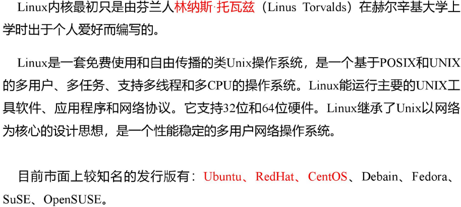
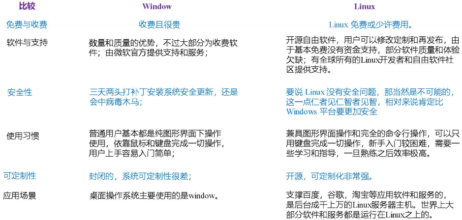
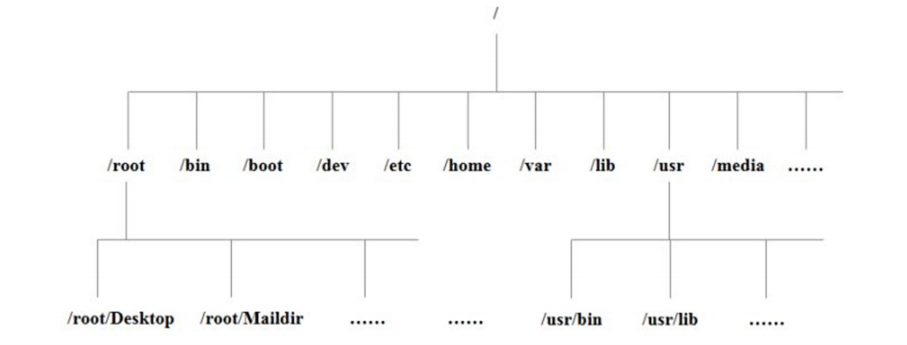

# 第一章-Linux概要

## 1 概述

## 2 Linux与Windows的区别

## 3 Linux的文件与目录结构

### 3.1 Linux文件

* **Linux系统中的一切都是文件**

### 3.2 Linux的目录结构

- /bin ：binary的缩写，这个目录存放着最经常使用的命令
- /sbin ：s即super user，这个目录存放着系统管理员使用的系统管理程序
- /home ：存放普通用户的主目录，在Linux中每个用户都有一个自己的目录，一般以自己的用户名命名
- /root ：系统管理员用户的主目录
- /lib ：系统开机所需要的最基本的动态链接共享库，几乎所有的应用程序都会用到这些共享库
- /lost+found ：一般为空，当非法关机后就会存放一些数据
- /etc ：系统管理所需要的配置文件
- /user ：很多应用程序和文件都放在这个目录下，类似于windows下的Program Files
- /boot ：存放启动linux时所需要的一些核心文件，包括一些连接文件和一些镜像文件
- /proc ：这是一个虚拟的目录，它时系统内存的映射，通过直接访问这个目录可以获得系统的信息
- /srv ：service的缩写，该目录存放一些服务启动后所需要提取的数据
- /sys ：安装linux2.6内核中新出现的sysfs文件系统
- /tmp ：存放临时文件
- /dev ： 类似于windows的设备管理器，将硬件以文件形式存储
- /media（centos6）：将U盘光驱等识别后挂载到这个目录，centos7后迁移到/run/media
- /mnt ：供用户临时挂载其它文件系统
- /opt ：给主机额外安装软件的目录，默认为空
- /var ：存放会不断扩充的或经常修改的文件，例如日志文件