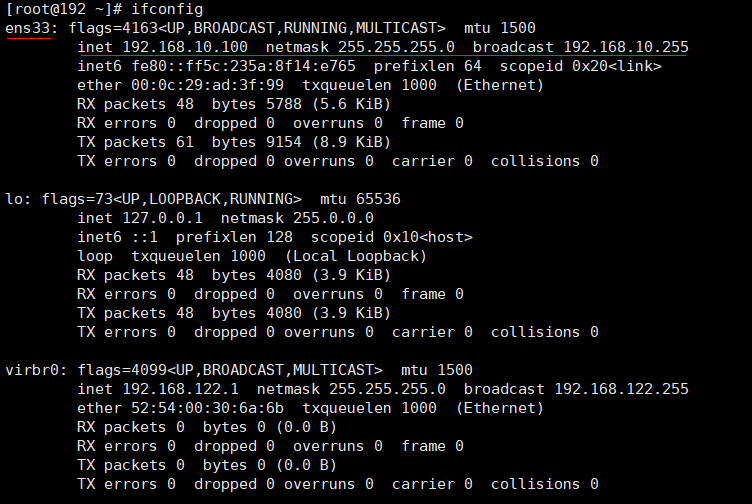
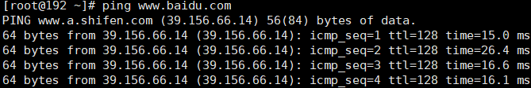
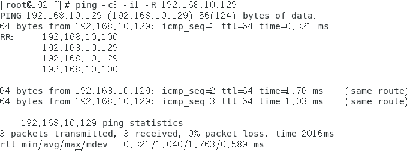

# 第二章-网络配置

## 1 ifconfig命令

**ifconfig :network interfaces configuring** 网络接口配置，在Linux终端输入ifconfig后显示：

ens33为网络设备的名称，之后则是IP地址、掩码和广播地址

## 2 测试网络的连通性

### 2.1 语法

ping 目的主机 （功能描述：测试当前服务器是否可以连接目的主机）

### 2.2 实例

### 2.3 拓展功能

* -c选项：设定对目标主机地址发送请求次数
* -b选项：允许ping广播地址，不带这个参数无法执行
* -D选项：ping输出时间戳
* -i选项：设置ping包发送间隔时间，单位秒
* -s选项：设置ping包发送大小，单位byte
* -w选项：设定执行时间，单位秒
* -f选项：极限测试：极限测试，ping的速度达到100次每秒
* -I选项：设置使用指定的网络接口发送网络包，这个选项在服务器有多个网络接入时使用
* -R选项：ping过程记录路由信息
* -r选项：忽略路由表，直接发送包给主机地址
* -q选项：不显示过程，只显示结果
* -v选项：显示详细执行过程，如果-q和-v同时使用，效果跟-q一致
* -t选项：设置存活数TTL的数值。TTL是IP包被路由器丢弃之前允许通过的最大网段数量。一般情况不需要设置。
* -4选项：指定IPv4协议
* -6选项：指定IPv6协议
* -F选项：设置流标记，只能用于IPv6.如果值时0，则会随机分派
* -B选项：不允许ping改变原地址的主目标。这个地址在ping开始时，它被绑定了一个已经选择的地址
* -W选项：以毫秒为单位设置ping的超时时间

## 3 修改IP地址

