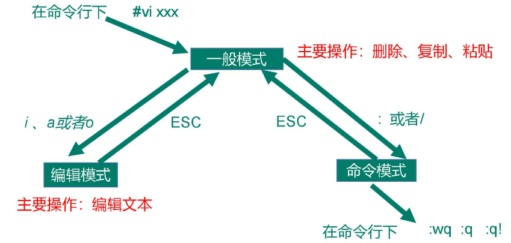
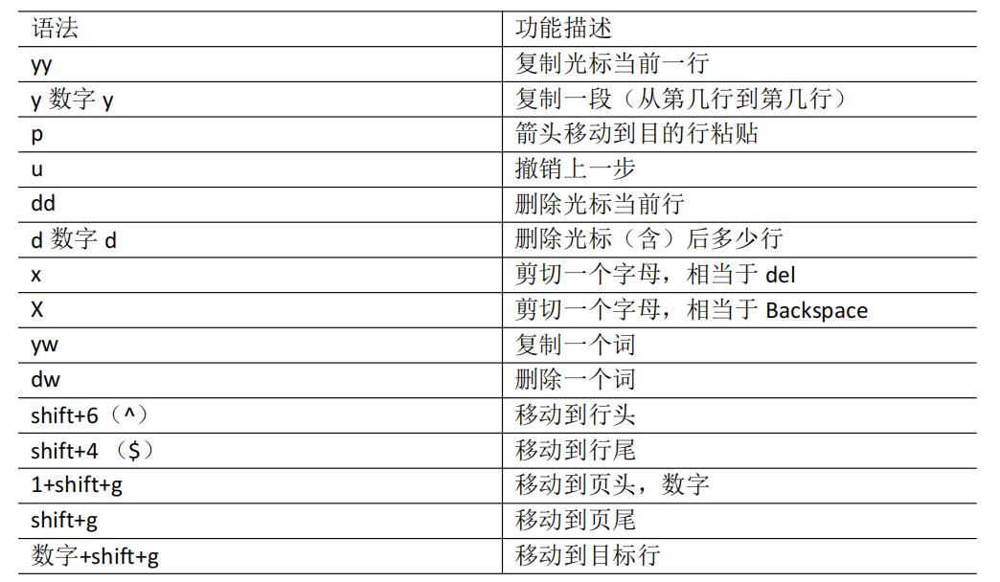
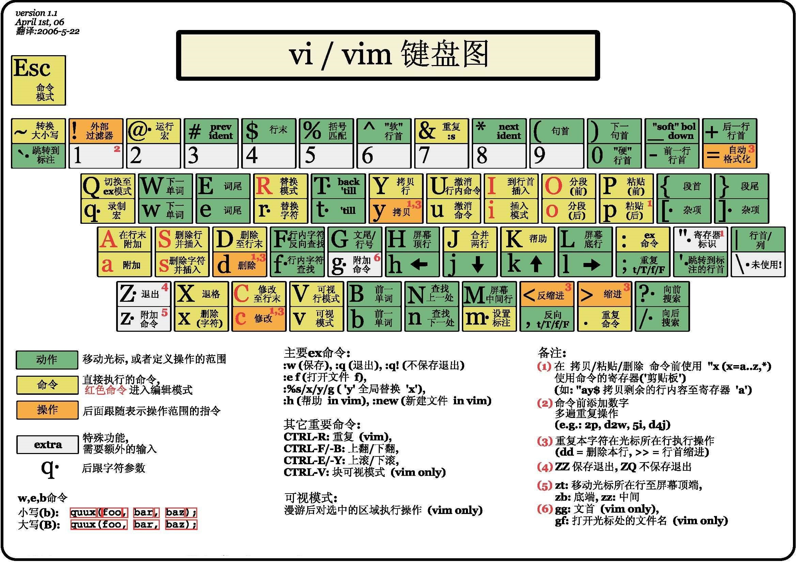
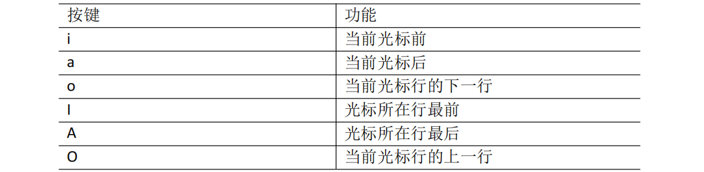
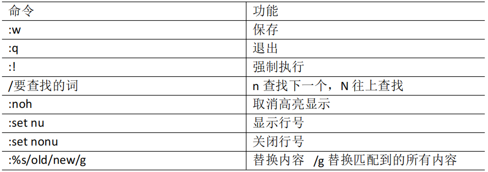

# 第零章-vi/vim编辑器

## 1 vi/vim编辑器是什么？

* vi 是 Unix 操作系统和类 Unix 操作系统中最通用的文本编辑器

* vim编辑器是从 vi 发展出来的一个性能更强大的文本编辑器。可以主动的以字体颜色辨别语法的正确性，方便程序设计。

* vim 与 vi 编辑器完全兼容。 

## 2 三种模式

## 3 一般模式

以 vi 打开一个档案就直接进入一般模式了（这是默认的模式）。在这个模式中， 你可以使用『上下左右』按键来移动光标，你可以使用『删除字符』或『删除整行』来处理档案内容， 也可以使用『复制、粘贴』来处理你的文件数据。

### 3.1 常用语法

### 3.2 vi键盘图

## 4 编辑模式

### 4.1 进入编辑模式

在一般模式中可以进行删除、复制、粘贴等的动作，但是却无法编辑文件内容的！要 等到你按下『i, I, o, O, a, A』等任何一个字母之后才会进入编辑模式。 

通常在Linux中，按下这些按键时，在画面的左下方会出现『INSERT或 REPLACE』的字样，此时才可以进行编辑。而如果要回到一般模式时， 则必须要按下 『Esc』这个按键即可退出编辑模式。

### 4.2 退出编辑模式

按『Esc』键 退出编辑模式进入一般模式

## 5 指令模式

在一般模式当中，输入『 : / ?』3个中的任何一个按钮，就可以将光标移动到最底下那 一行。

在这个模式当中， 可以提供你『搜寻资料』的动作，而读取、存盘、大量取代字符、 离开 vi 、显示行号等动作是在此模式中达成的

### 5.1 基本语法

